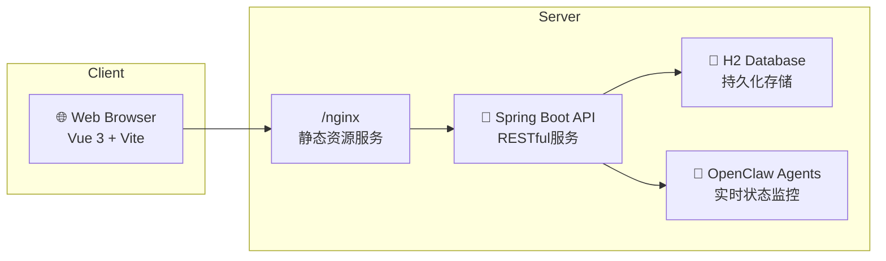
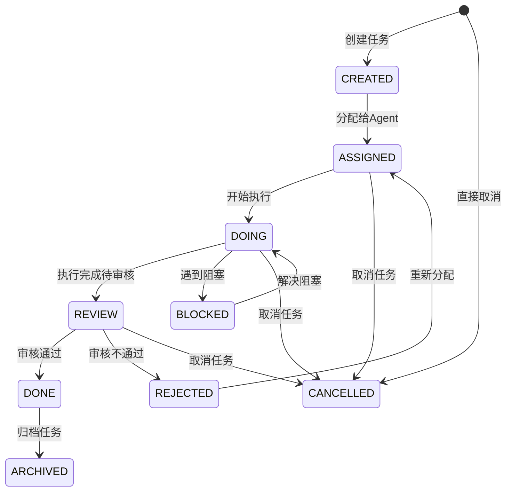
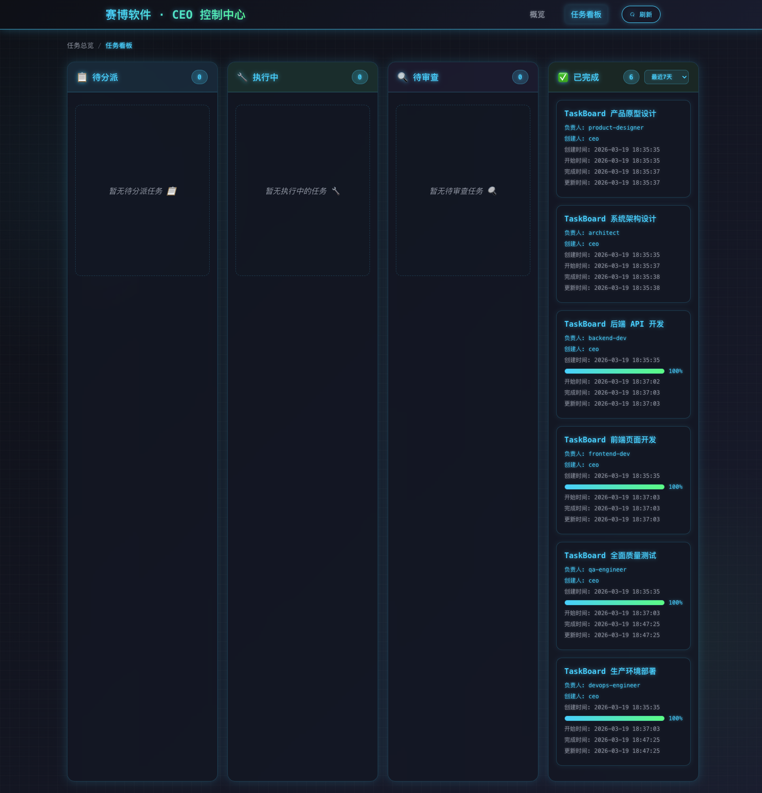

# Cyble CEO Dashboard

> 🤖 OpenClaw 多 Agent 协作监控看板 —— 像 CEO 一样掌控 AI 团队全局

**本项目由 OpenClaw 多 Agent 团队自主协作开发。** 从需求分析、架构设计、前后端开发、测试到部署，全程由 AI Agent 完成，CEO Agent 负责决策和验收。这不仅是一个产品，也是 OpenClaw 多 Agent 协作能力的真实验证。


## 🏗️ 系统架构



**数据流向**: Agent状态变化 → API接收 → 数据库存储 → 前端展示

**技术栈**:
- **前端**: Vue 3 + Vue Router + Vite + CSS
- **后端**: Spring Boot 3 + Spring Data JPA + JDK 17
- **数据库**: H2 (嵌入式文件数据库)
- **部署**: Docker + Docker Compose + Nginx

## ✨ 功能特性详细说明

### 任务看板功能
- 📊 **全局概览** — 一页总览所有 Agent 运行状态和关键指标
- 🤖 **Agent 详情** — 查看每个 Agent 的实时状态、当前任务和历史记录
- 📋 **任务看板** — 可视化任务流转（待分派 → 执行中 → 待审查 → 已完成）
- 📝 **日志查看器** — 集中浏览 Agent 上报的日志
- 💬 **交互记录** — 追踪 Agent 之间的协作交互
- 🚨 **告警横幅** — 自动检测异常 Agent 并高亮展示
- 📈 **进度追踪** — 实时进度条展示任务完成度
- 🗄️ **任务归档** — 已完成任务自动归档，看板保持清爽
- 📄 **分页 & 时间过滤** — 大量任务数据轻松管理

### 任务状态机流转


### 分页和归档机制
- **智能分页**: 支持按页码、页面大小分页显示任务
- **时间过滤**: 支持按时间范围筛选任务（如最近7天、30天等）
- **自动归档**: 完成的任务可自动归档，保持看板整洁
- **软删除**: 归档任务保留数据但不在主看板显示

### Agent 状态同步
- **心跳机制**: Agent定期上报心跳，实时反映在线状态
- **状态监控**: 监控Agent的活跃度和健康状况
- **实时更新**: 状态变更即时同步到前端展示

## 🖼️ 界面截图

### 概览页面


### 任务看板


### Agent 详情页


这些截图展示了系统的实际运行效果，包括全局概览、任务看板和Agent详情等核心功能界面。

## 🛠 技术栈

| 层 | 技术 |
|---|------|
| 前端 | Vue 3 + Vue Router + Vite |
| 后端 | Spring Boot 3 + Spring Data JPA |
| 数据库 | H2（嵌入式，零配置） |
| 部署 | Docker + Docker Compose + Nginx |

## 🚀 快速开始

### 环境要求

- [Docker](https://docs.docker.com/get-docker/) 20.10+
- [Docker Compose](https://docs.docker.com/compose/install/) v2+
- [OpenClaw](https://github.com/nicepkg/openclaw) 已安装并配置好 Agent

### 一键部署

```bash
git clone https://github.com/996Code/cyble-ceo.git
cd cyble-ceo

# 运行一键搭建脚本（自动检测环境、生成配置、构建部署）
chmod +x setup.sh
./setup.sh
```

脚本会自动完成：
1. ✅ 检查 Docker 环境
2. ✅ 检测 OpenClaw agents 目录
3. ✅ 生成 `.env` 配置文件
4. ✅ 构建前后端 Docker 镜像
5. ✅ 启动服务并等待健康检查

完成后访问 **http://localhost** 即可看到 Dashboard。

### 手动部署

如果你更喜欢手动控制：

```bash
git clone https://github.com/996Code/cyble-ceo.git
cd cyble-ceo

# 配置环境变量
cp .env.example .env
# 编辑 .env，设置 OPENCLAW_AGENTS_PATH 为你的 agents 目录路径

# 构建并启动
docker compose up -d

# 查看日志
docker compose logs -f
```

### 配置说明

| 变量 | 说明 | 默认值 |
|------|------|--------|
| `OPENCLAW_AGENTS_PATH` | OpenClaw agents 目录路径 | `./data/agents` |
| `DB_PASSWORD` | H2 数据库密码（可选） | _(空)_ |
| `PORT` | 前端访问端口 | `80` |

## 📡 API 文档

### 主要 API 端点列表

| 方法 | 路径 | 功能说明 |
|------|------|----------|
| `GET` | `/api/v1/dashboard/overview` | 获取全局概览 |
| `GET` | `/api/v1/dashboard/agents/{id}` | 获取 Agent 详情 |
| `GET` | `/api/v1/tasks` | 获取任务列表（支持分页/过滤） |
| `POST` | `/api/v1/tasks` | 创建任务（支持 initialStatus 参数） |
| `GET` | `/api/v1/tasks/{id}` | 获取任务详情 |
| `PUT` | `/api/v1/tasks/{id}/state` | 更新任务状态 |
| `PUT` | `/api/v1/tasks/{id}/progress` | 更新任务进度 |
| `PUT` | `/api/v1/tasks/{id}/done` | 完成任务 |
| `POST` | `/api/v1/tasks/archive` | 归档任务 |
| `DELETE` | `/api/v1/tasks/clear-all` | 清空所有任务（仅开发环境） |

### 请求/响应示例

#### 获取任务列表
**请求**: `GET /api/v1/tasks?page=0&size=20&days=7&includeArchived=false`

**响应**:
```json
{
  "code": 200,
  "message": "success",
  "data": {
    "content": [
      {
        "id": "T-001",
        "title": "实现登录功能",
        "description": "开发用户登录模块",
        "status": "DOING",
        "assignee": "backend-dev",
        "progress": 75,
        "createdAt": "2024-01-01T10:00:00",
        "updatedAt": "2024-01-01T15:30:00"
      }
    ],
    "totalElements": 1,
    "totalPages": 1,
    "currentPage": 0,
    "size": 20
  },
  "timestamp": "2024-01-01T16:00:00"
}
```

#### 创建任务
**请求**: `POST /api/v1/tasks`

**请求体**:
```json
{
  "title": "修复登录bug",
  "description": "修复用户无法登录的问题",
  "assignee": "backend-dev",
  "initialStatus": "DOING"
}
```

**响应**:
```json
{
  "code": 200,
  "message": "任务创建成功",
  "data": {
    "id": "T-002",
    "title": "修复登录bug",
    "description": "修复用户无法登录的问题",
    "status": "DOING",
    "assignee": "backend-dev",
    "progress": 0,
    "createdAt": "2024-01-01T16:00:00",
    "updatedAt": "2024-01-01T16:00:00"
  },
  "timestamp": "2024-01-01T16:00:00"
}
```

#### 更新任务状态
**请求**: `PUT /api/v1/tasks/T-001/state`

**请求体**:
```json
{
  "status": "REVIEW"
}
```

**响应**:
```json
{
  "code": 200,
  "message": "任务状态更新成功",
  "data": {
    "id": "T-001",
    "status": "REVIEW",
    "updatedAt": "2024-01-01T17:00:00"
  },
  "timestamp": "2024-01-01T17:00:00"
}
```

### 状态码说明

- `200`: 请求成功
- `400`: 请求参数错误或校验失败
- `404`: 资源未找到
- `409`: 状态转换冲突（如无效的状态流转）
- `500`: 服务器内部错误

### 分页参数

所有列表接口支持以下分页参数：

| 参数 | 类型 | 默认值 | 说明 |
|------|------|--------|------|
| `page` | Integer | 0 | 页码（从0开始） |
| `size` | Integer | 20 | 每页数量 |
| `days` | Integer | - | 只返回最近N天的数据 |
| `includeArchived` | Boolean | false | 是否包含已归档任务 |

### 任务状态说明

- `CREATED`: 已创建
- `ASSIGNED`: 已分配
- `DOING`: 执行中
- `BLOCKED`: 已阻塞
- `REVIEW`: 待审查
- `REJECTED`: 已拒绝
- `DONE`: 已完成
- `CANCELLED`: 已取消
- `ARCHIVED`: 已归档

## 📁 项目结构

```
cyble-ceo/
├── setup.sh                    # 一键环境搭建脚本
├── docker-compose.yml          # 部署编排文件
├── .env.example                # 环境变量模板
├── backend/                    # Spring Boot 后端
│   ├── Dockerfile
│   ├── pom.xml
│   └── src/
├── frontend/                   # Vue 3 前端
│   ├── Dockerfile
│   ├── nginx.conf
│   ├── package.json
│   └── src/
├── scripts/                    # Agent 上报脚本
│   ├── agent-report.sh         # Agent 数据上报 CLI
│   ├── dashboard-task.sh       # 任务管理 CLI
│   └── report.sh               # CEO 快捷上报入口
├── openclaw-config/            # OpenClaw Agent 配置模板
│   └── templates/              # 各角色的 AGENTS.md / SOUL.md / HEARTBEAT.md
└── docs/                       # API 文档
```

## 🤖 关于 OpenClaw 多 Agent 协作

本项目展示了一种完整的 AI 团队协作模式。通过 [OpenClaw](https://github.com/nicepkg/openclaw)，多个 AI Agent 各司其职，像真实团队一样协作开发：

```
CEO（决策） → Product Designer（需求） → Architect（架构）
     ↓                                        ↓
QA（测试）  ← Frontend Dev（前端） ← Backend Dev（后端）
     ↓
DevOps（部署）
```

### 参与开发的 Agent 角色

| 角色 | 职责 |
|------|------|
| 🎯 **CEO** | 战略决策、任务分派、验收交付物 |
| 🎨 **Product Designer** | 需求分析、原型设计、PRD 编写 |
| 🏗️ **Architect** | 技术选型、架构设计、代码审查 |
| ⚙️ **Backend Dev** | API 开发、业务逻辑、数据库设计 |
| 🖥️ **Frontend Dev** | UI 开发、交互实现、样式设计 |
| 🧪 **QA Engineer** | 测试用例、自动化测试、回归验证 |
| 🚀 **DevOps Engineer** | 容器化、部署配置、运维脚本 |

项目在 `openclaw-config/templates/` 下提供了所有角色的配置模板，你可以直接复用来搭建自己的 AI 团队。

### 使用 Agent 配置模板

```bash
# 将模板复制到对应 Agent 的 workspace 目录
cp -r openclaw-config/templates/ceo/* ~/.openclaw/workspace-ceo/
cp -r openclaw-config/templates/backend-dev/* ~/.openclaw/workspace-backend-dev/
# ... 其他角色同理
```

## 📡 Agent 数据上报

Agent 通过脚本向 Dashboard 上报状态和任务进度。

### 任务管理

```bash
# 创建任务（支持一步到位指定状态）
./scripts/dashboard-task.sh create "T-001" "实现登录功能" "backend-dev"

# 更新进度
./scripts/dashboard-task.sh progress "T-001" "接口开发完成" 80

# 完成任务
./scripts/dashboard-task.sh done "T-001" "登录功能已上线"

# 查看任务列表
./scripts/dashboard-task.sh list
./scripts/dashboard-task.sh list DOING
```

### Agent 状态上报

```bash
# 上报心跳
./scripts/agent-report.sh heartbeat "backend-dev"

# 上报日志
./scripts/agent-report.sh log "backend-dev" "INFO" "数据库迁移完成"

# 上报进度
./scripts/agent-report.sh progress "backend-dev" "API 开发中" "接口设计完成" 60
```

## 🔧 本地开发

### 后端

```bash
cd backend
mvn spring-boot:run
# API 运行在 http://localhost:8080
```

### 前端

```bash
cd frontend
npm install
npm run dev
# 开发服务器运行在 http://localhost:3000（自动代理 API 到 8080）
```

## 📡 API 概览

| 方法 | 路径 | 说明 |
|------|------|------|
| `GET` | `/api/v1/tasks` | 任务列表（支持 `page`/`size`/`days` 分页过滤） |
| `POST` | `/api/v1/tasks` | 创建任务（支持 `initialStatus` 一步到位） |
| `GET` | `/api/v1/tasks/{id}` | 任务详情（含流转记录和子任务） |
| `PUT` | `/api/v1/tasks/{id}/state` | 更新任务状态（状态机校验） |
| `PUT` | `/api/v1/tasks/{id}/progress` | 更新任务进度 |
| `PUT` | `/api/v1/tasks/{id}/done` | 完成任务 |
| `POST` | `/api/v1/tasks/archive` | 归档已完成任务（软删除） |
| `DELETE` | `/api/v1/tasks/clear-all` | 清空所有任务（仅开发环境） |
| `GET` | `/api/v1/dashboard/overview` | 全局概览 |
| `GET` | `/api/v1/dashboard/agents/{id}` | Agent 详情 |

详细 API 文档见 [docs/API_DOC.md](docs/API_DOC.md)。

## 🎨 任务状态流转

```
CREATED → ASSIGNED → DOING → REVIEW → DONE
                       ↓        ↓
                    BLOCKED   REJECTED → ASSIGNED
                       ↓
                     DOING

任何状态 → CANCELLED
```

## 📄 License

MIT

## 🙏 致谢

- [OpenClaw](https://github.com/nicepkg/openclaw) — 多 Agent 协作框架，也是本项目的开发者
- [Vue 3](https://vuejs.org/) + [Spring Boot](https://spring.io/projects/spring-boot) — 可靠的技术栈
