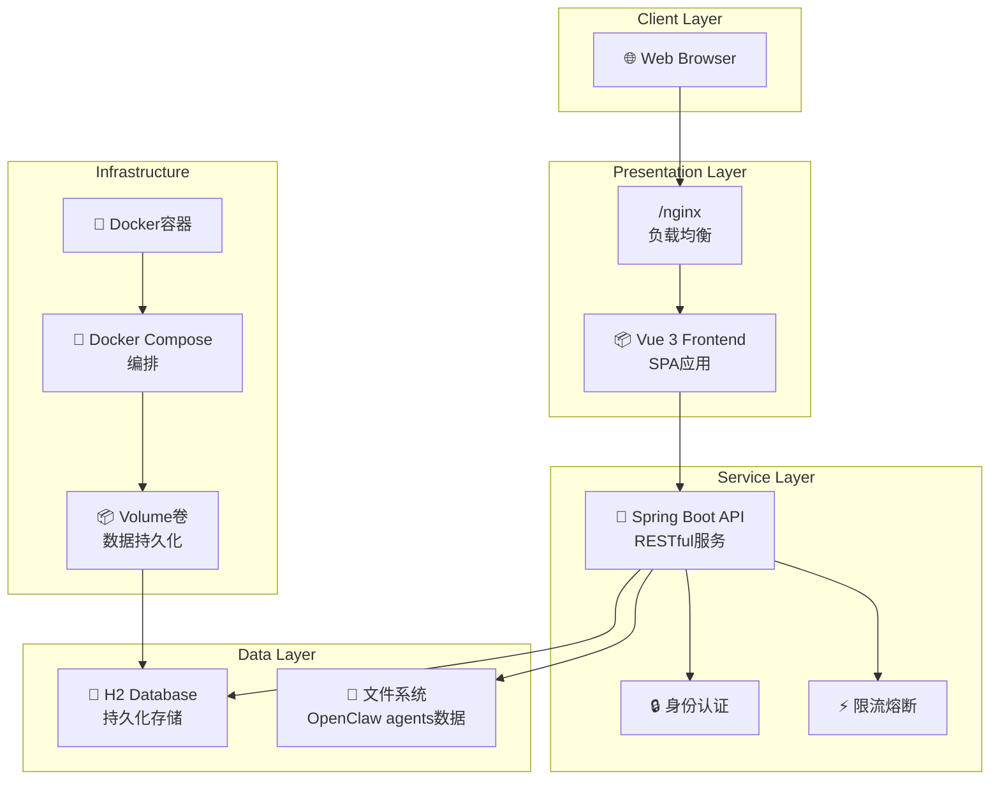
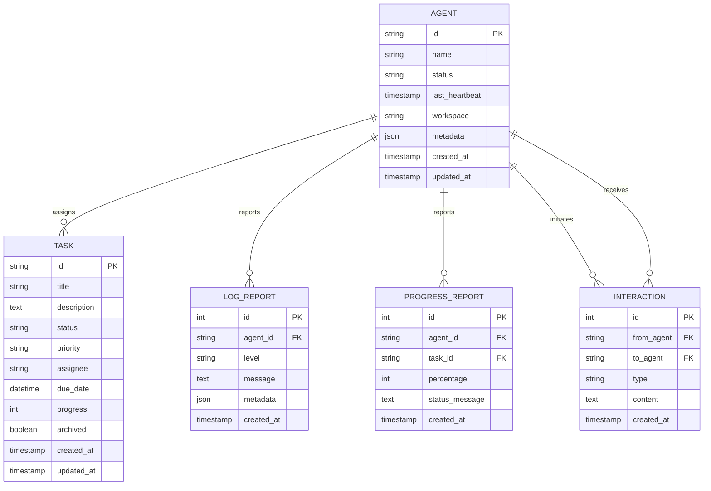

# CEO Dashboard 系统架构设计文档

## 1. 系统架构

### 1.1 整体架构图



### 1.2 技术选型理由

#### 前端技术栈
- **Vue 3**: 轻量级、高性能的现代前端框架，组件化开发提升可维护性
- **Vite**: 快速的构建工具，热重载提升开发体验
- **CSS**: 响应式设计适配不同设备

#### 后端技术栈
- **Spring Boot 3**: 企业级Java框架，开箱即用的特性加快开发速度
- **JDK 17**: LTS版本，性能和安全性都有保障
- **Spring Data JPA**: 简化数据库操作，ORM映射提升开发效率

#### 数据库
- **H2 Database**: 
  - 嵌入式数据库，零配置部署
  - 支持SQL标准，兼容性强
  - 文件型存储，便于数据备份和迁移

#### 部署方案
- **Docker**: 容器化部署，环境一致性保证
- **Docker Compose**: 多服务编排，简化部署流程
- **Nginx**: 静态资源服务，反向代理

### 1.3 模块划分

```
CEO Dashboard/
├── frontend/                 # 前端模块
│   ├── src/
│   │   ├── components/       # Vue组件
│   │   ├── views/           # 页面视图
│   │   ├── router/          # 路由配置
│   │   ├── api/             # API接口封装
│   │   └── utils/           # 工具函数
│   ├── dist/                # 构建产物
│   └── nginx.conf           # Nginx配置
├── backend/                  # 后端模块
│   ├── src/
│   │   ├── controller/      # 控制层
│   │   ├── service/         # 业务逻辑层
│   │   ├── repository/      # 数据访问层
│   │   ├── entity/          # 实体类
│   │   ├── dto/             # 数据传输对象
│   │   └── config/          # 配置类
│   └── pom.xml              # 依赖管理
├── scripts/                  # 脚本模块
│   ├── agent-report.sh      # Agent数据上报
│   └── dashboard-task.sh    # 任务管理CLI
└── docker-compose.yml       # 部署编排
```

## 2. 数据库设计

### 2.1 ER 图



### 2.2 主要表结构说明

#### Agent 表
- 存储所有Agent的基本信息和状态
- 包含心跳时间用于健康检查
- metadata字段存储额外的配置信息

#### Task 表
- 核心任务表，支持完整的任务生命周期
- archived字段实现软删除，支持归档功能
- 支持进度跟踪和状态流转

#### Log Report 表
- 存储Agent上报的日志信息
- 支持多种日志级别（INFO, WARN, ERROR等）
- 便于问题排查和系统监控

#### Interaction 表
- 记录Agent之间的交互历史
- 用于追踪协作关系和通信模式

### 2.3 索引设计

- **Agent表**: 在id和last_heartbeat上建立索引，优化健康检查查询
- **Task表**: 在status, archived, created_at上建立复合索引，优化列表查询
- **Log Report表**: 在agent_id和created_at上建立索引，优化日志检索
- **Interaction表**: 在from_agent, to_agent和created_at上建立索引

## 3. API 设计

### 3.1 RESTful 规范

遵循RESTful API设计原则：

- **GET**: 查询操作，幂等性
- **POST**: 创建操作，非幂等性
- **PUT/PATCH**: 更新操作，幂等性
- **DELETE**: 删除操作，幂等性

### 3.2 统一响应格式

```json
{
  "code": 200,
  "message": "success",
  "data": {},
  "timestamp": "2024-01-01T10:00:00Z"
}
```

### 3.3 主要API端点

| 方法 | 路径 | 描述 | 认证 |
|------|------|------|------|
| GET | `/api/v1/dashboard/overview` | 获取全局概览 | 无需 |
| GET | `/api/v1/dashboard/agents/{id}` | 获取Agent详情 | 无需 |
| GET | `/api/v1/tasks` | 获取任务列表（支持分页/过滤） | 无需 |
| POST | `/api/v1/tasks` | 创建任务（支持初始状态） | 无需 |
| PUT | `/api/v1/tasks/{id}/state` | 更新任务状态 | 无需 |
| PUT | `/api/v1/tasks/{id}/progress` | 更新任务进度 | 无需 |
| PUT | `/api/v1/tasks/{id}/done` | 完成任务 | 无需 |
| POST | `/api/v1/tasks/archive` | 归档任务 | 无需 |
| DELETE | `/api/v1/tasks/clear-all` | 清空所有任务（开发环境） | 无需 |

### 3.4 认证机制

当前版本采用无认证设计，适用于内部使用场景。如需增强安全性：

- 基于JWT的Token认证
- API Key访问控制
- OAuth2.0集成

### 3.5 限流策略

- 接口访问频率限制（如每分钟100次）
- IP地址访问限制
- 用户级别的请求配额

## 4. 部署架构

### 4.1 Docker 容器编排

```yaml
services:
  api:                    # 后端API服务
    build: ./backend
    container_name: cyble-ceo-api
    environment:
      - TZ=Asia/Shanghai
      - DB_PASSWORD=${DB_PASSWORD:-}
    volumes:
      - ${OPENCLAW_AGENTS_PATH}:/openclaw/agents:ro
      - h2-data:/app/data
    healthcheck:
      test: ["CMD", "curl", "-f", "http://localhost:8080/api/v1/dashboard/overview"]
  
  frontend:               # 前端服务
    build: ./frontend
    container_name: cyble-ceo-frontend
    ports:
      - "${PORT:-80}:80"
    depends_on:
      api:
        condition: service_healthy
```

### 4.2 网络配置

- **bridge网络**: 使用自定义bridge网络保证服务间通信
- **端口映射**: 仅前端端口对外暴露，后端服务内部通信
- **健康检查**: 通过HTTP接口验证服务状态

### 4.3 数据持久化

- **H2数据库文件**: 通过volume挂载到宿主机，防止数据丢失
- **Agent数据**: 只读挂载OpenClaw agents目录，实时同步状态
- **日志数据**: Docker日志驱动，支持日志轮转

### 4.4 高可用考虑

- **重启策略**: `restart: unless-stopped` 确保服务异常后自动重启
- **健康检查**: 定期检查API服务状态，依赖关系管理
- **资源限制**: 可添加内存/CPU限制防止资源耗尽

## 5. 监控与运维

### 5.1 日志管理

- 应用日志通过Docker日志驱动收集
- 结构化日志输出便于分析
- 错误日志分级管理

### 5.2 性能监控

- API响应时间监控
- 数据库查询性能分析
- 系统资源使用率监控

### 5.3 备份策略

- H2数据库文件定期备份
- 重要配置文件版本管理
- 自动化备份脚本